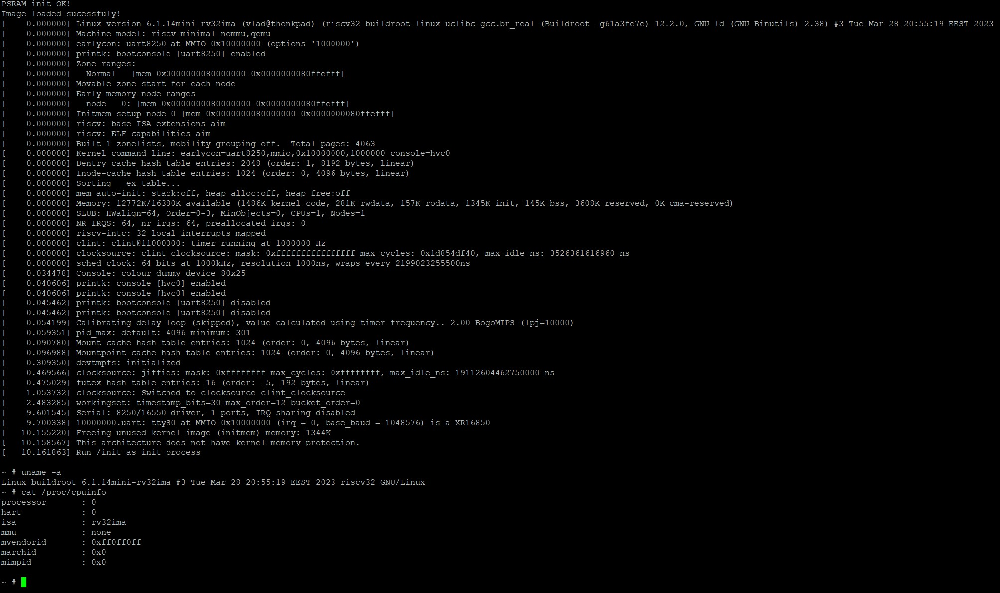
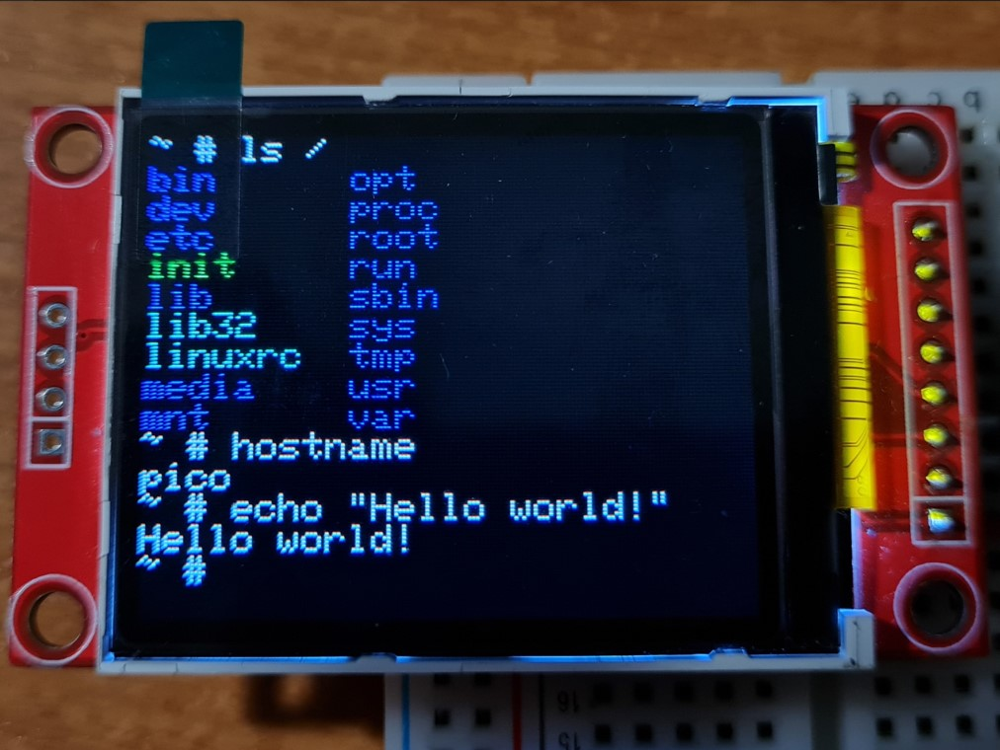

# Pico Linux

RISC-V emulator for RP2040, capable of running Linux.\

Based on [pico-rv32ima by tvlad1234](https://github.com/tvlad1234/pico-rv32ima).\
Based on [mini-rv32ima by CNLohr](https://github.com/cnlohr/mini-rv32ima).

## How It Works

This project uses [CNLohr's mini-rv32ima](https://github.com/cnlohr/mini-rv32ima) RISC-V emulator core to run Linux on a Raspberry Pi Pico.\
It uses two 8 megabyte SPI PSRAM chips as system memory. To alleviate the bottleneck introduced by the SPI interface of the PSRAM, a 4kb cache is used.\
The cache implementation comes from [xhackerustc's uc32-rvima project](https://github.com/xhackerustc/uc-rv32ima).

## Usage

### Requirements
- a Raspberry Pi Pico (or other RP2040 board)
- an SD card
- two 8 megabyte (64Mbit) SPI PSRAM chips (tvlad1234 used LY68L6400, I used PSRAM64H).
    - it is possible to use only one of these chips when running a reduced system image, by changing a setting in the config file.

_This project overvolts and overclocks the RP2040! Use at own risk!_

### Wiring
The configuration can be modified in the [rv32_config.h](pico-rv32ima/config/rv32_config.h) file.

- By default, the SD card is connected via SPI, with the following pinout:
    - CLK: GPIO18
    - MISO: GPIO16
    - MOSI: GPIO19
    - CS: GPIO20
- The SD card may also be connected over SDIO.

- The two RAM chips are connected with the following default pinout:
    - CLK: GPIO10
    - MISO: GPIO12
    - MOSI: GPIO11
    - CS1: GPIO21
    - CS2: GPIO22
- The RAM chips use hardware SPI by default. A flag in the config file allows them to use software bit-banged SPI.

### SD card setup
The SD card needs to be formatted as FAT32 or exFAT. Block sizes from 1024 to 4096 bytes are confirmed to be working. A prebuilt Linux kernel and filesystem image is provided in [this file](linux/Image). It must be placed in the root of the SD card.\
If you want to build the image yourself, you need to run `make` in the [linux](linux) folder. This will clone the buildroot source tree, apply the necessary config files and build the kernel and system image.

### Software
The system console is accessible over USB-CDC, UART or an 128x160 ST7735 display paired with a PS2 keyboard. All three can be used at the same time, but keep in mind they point to the same virtual console. They can be enabled or disabled as desired in the config file. By default, the UART console and LCD console is enabled.

## How It Works

This project uses [CNLohr's mini-rv32ima](https://github.com/cnlohr/mini-rv32ima) RISC-V emulator core to run Linux on a Raspberry Pi Pico.\
It uses two 8 megabyte SPI PSRAM chips as system memory. To alleviate the bottleneck introduced by the SPI interface of the PSRAM, a 4kb cache is used.\
The cache implementation comes from [xhackerustc's uc32-rvima project](https://github.com/xhackerustc/uc-rv32ima).

## What it does

The boot process is described below:
- On powerup, the Linux image will be copied into RAM. 
- After a few seconds, Linux kernel messages will start streaming on the console. 
- After around a minute and half, it will boot into the console

It uses the RISC-V emulator core to run the compiled Linux kernel on a Raspberry Pi Pico.
## Demo

### Video
- A video of the boot process can be seen [here](https://youtu.be/txgoWddk_2I)

### Pictures
- Serial (USB or UART) console:
    - 
- LCD console:
    - 
## Authors

- [ElectroBoy404NotFound (pico-linux)](https://github.com/ElectroBoy404NotFound/pico-linux)
- [tvlad1234 (pico-rv32ima)](https://github.com/tvlad1234/pico-rv32ima)
- [CNLohr (mini-rv32ima)](https://github.com/cnlohr/mini-rv32ima)
- [xhackerustc (uc32-rvima)](https://github.com/xhackerustc/uc-rv32ima/)
